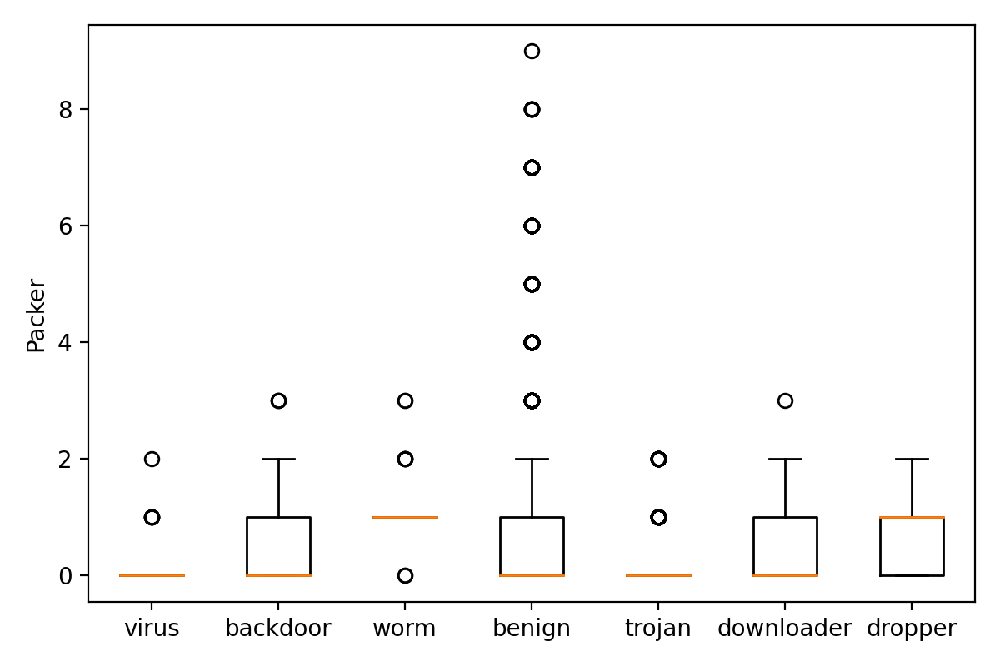

# Malware Detection cum Classifier
Detects and classifies malware from static and dynamic analysis of a PE executable
- Static Analysis
  - Strings.txt (contains strings output of file)
  - Structure_Info.txt (contains the PE structure info of the PE file)
- Dynamic Analysis
  - Dynamic analysis information extracted by running PE in cuckoo sandbox

# Team IITBreachers
## Himanshu Sheoran
## Lakshya Kumar
## Ritik Roongta

## Requirements to run
We have run on python3.8, use requirements.txt to install the required packages  
Other requirements being about a GB of free space in the directory in which code is being run


## Submission Structure
### [MalwareDetection.py](MalwareDetection.py)
Usage info: `python3 MalwareDetection.py <path to testing data>`
Uses the model `trained_model.pickle`  
Output is stored in `output.csv`
Intermediate CSV `temp_features.csv` is generated containing selected features.

#### Assumptions on test directory
The test directory has the requirements 
Static analysis data has `String.txt` and `Structure_Info.txt` under the directory of SHA256(file_name) somewhere in the supplied path  
Dynamic Analysis data as SHA256(file_name).json somewhere in the supplied path
```
0a0ee0aa381260d43987e98dd1a6f4bab11164e876f21db6ddb1db7c319c5cf8
   ├── String.txt
   └── Structure_Info.txt
└── 0a2adcac2b16b02d475e9d47b4772b77b0b4269132f07557c7ef6081727585da.json
```

### [train.py](train.py)
The file used to train the model. The training is done in two phases:
1. Data collection and feature selection, the dynamic and static analysis data is parsed for all the files and stored temporarily in [filtered_data](filtered_data) under filename `<hash>_filtered.json`  
If training data is not filtered already,  
Usage: `python3 train.py filter <path to training data>`  
> NOTE: It is assumed that training data contains the directory "Static_Analysis_Data"  

If the training data has been filtered already into `filtered_data`  
Usage: `python3 train.py`  
Generates `training_data.csv` and `trained_model.csv`

### [filtered.7z](filtered.7z)
Compressed `filtered_data`, use `7z x filtered.7z -ofiltered_data` to create `filtered_data` directory

### [trained_model.pickle](trained_model.pickle)
Trained model generated after training from `filtered_data` 

### output.csv
Output csv containing filename, class pairs  
> Generated on running MalwareDetection.py

### temp_features.csv
Temporary selected features of test_data are stored
> Generated on running MalwareDetection.py

### filtered_data
Filtered training data is stored in this directory used for further training of model
> `7z x filtered.7z -ofiltered_data`

### [training_data.csv](training_data.csv)
Generates an intermediate csv of selected features from `filtered_data`
> generated on running train.py

### [requirements.txt](requirements.txt)
Details of packages installed  
`pip3 install -r requirements.txt`

### [clean.py](clean.py)
Cleans the temporary results in `filtered_data` and `temp_features.csv` 
Usage: `python3 clean.py`

### temp_test_filtered
Temporary directory generated on running `MalwareDetection.py` which contains the filtered test files  
> Generated on running MalwareDetection.py


## Feature Extraction (Pre-Processing)
Since the training data is HUGE and contains a lot of unnecessary information, both training data and test data are pre-processed to get intermediate filtered_data.
We have parsed the data to extract the following vaules

### Static Analysis Data

## Strings.txt
parsed_data: Dictionary with following features
- num_strings: number of strings in "Strings.txt"
- passwords: list of hardcoded common passwords
- addresses: hardcoded ipv4,ipv6 and urls
- hex_str: seemingly long hex strings
- b64_str: seemingly long base64 strings
- packer: list of packer associated strings
- exes: hardcoded exe names in binary
- len: size of "Strings.txt"

## Structure_Info.txt
filtered_data: A dictionary with selected fields namely
- sections (List of PE sections with information regarding)
- section name `name`
- virtual size of section `virtual_size`
- raw data size of section `raw_data_size`
- `entropy` of section
- dlls: list of imported symbols
- OPTIONAL_HEADER information
  - SizeOfCode
  - SizeOfInitializedData
  - SizeOfUninitializedData
  - SizeOfStackReserve
  - SizeOfStackCommit
  - SizeOfHeapReserve
  - SizeOfHeapCommit
- FILE_HEADER info
  - NumberOfSections
  - NumberOfSymbols


### Dynamic Analysis Data

- Behavior
	- count of API calls
	- file_created
	- file_written
	- directory_created
	- dll_loaded
	- file_opened
	- regkey_opened
	- guid
	- file_read
	- regkey_read
	- regkey_deleted
	- directory_enumerated
	- directory_removed
	- mutex
	- connects_ip
- Network
	- UDP source and destination IPs
	- DNS requests and answers
	- ICMP source and destination info
	- HTTP requests
	- TCP source and destination IPs

## Feature Selection
### Section Entropy
The PE sections contain data which usually has a known entropy. Higher entropy can indicate packed data. Malicious files are commonly packed to avoid static analysis since the actual code is usually stored encrypted in one of the sections and will only be extracted at runtime.    
So entropy is an important feature, we used average, min and max entropy as separate features.   


### Number of Strings (num_strings)

Number of strings in the strings.txt file is an important feature because most malwares are packed and contain less strings as compared to a benign executable that is not packed.


### Size of file (Length)

As most malwares are packed their size is generally smaller than a benign file. In the plot, we can see that most benign executables have larger size.


### Packer present

Malware files are usually packed with common packers like UPX, ASPack, etc. They can be identified using the header of the files where the signature of the packer is present.



### UDP Destination Address

Most malwares try to connect to a remote server, either to transfer data or to establish a reverse shell. The number of UDP destination addresses can very effectively differentiate a malware from a benign executable, as malware are likely to make more UDP calls.


## Training
In training phase, the most time is taken for filtering features, it takes about two hours to parse and generate intermediate files for about 10000 training files.  
Once `filtered_data` is generated (which has been provided in the package), training a model takes about 2 minutes.

We chose DecisionTree Classifier as the base estimator for Bagging Classifier
The classifier classifies between the classes Benign, Trojan, Virus, Worm, Trojandownloader, Trojandropper, Backdoor with a training accuracy of 96%
Squishing the classifier to Benign and Malware produces a very good classifier with almost 100% precision, recall and fscore even with  training/testing split to be 60/40.

```
BAG SCORE: 0.9798792756539235
ACCURACY: 1.0
PRECISION: [1. 1.]
RECALL: [1. 1.]
F-SCORE: [1. 1.]
```

